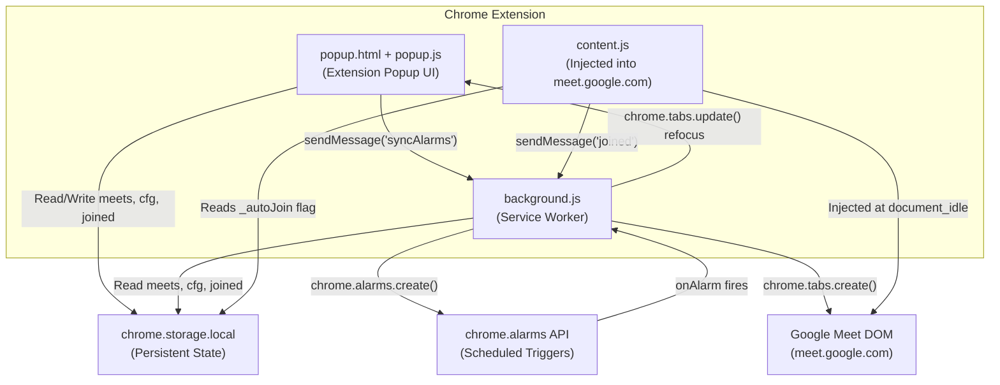
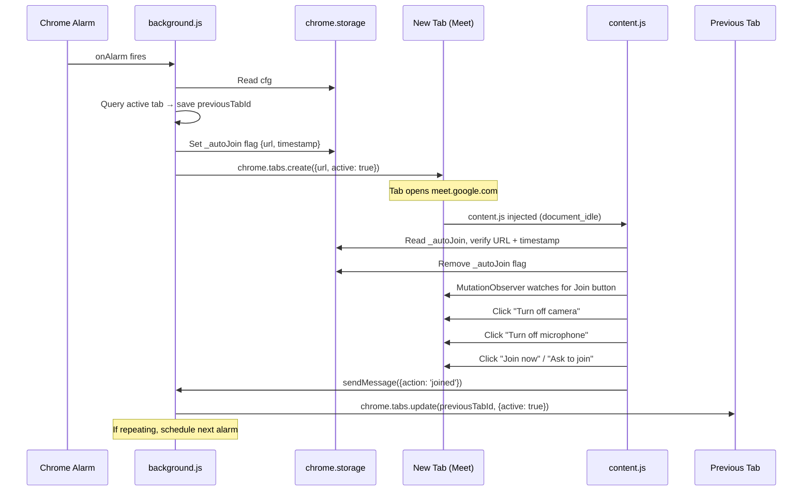
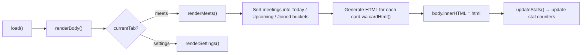

# MeetAuto — Advanced Technical Deep Dive

## 1. Project Overview

**MeetAuto** is a **Chrome Extension (Manifest V3)** that automates joining Google Meet calls. Users schedule meetings via a popup UI, and the extension automatically opens the Meet link at the scheduled time, disables camera/microphone, clicks the "Join Now" button, and refocuses the user's previous tab — all without manual intervention.

### Core Value Proposition
> "Set it and forget it" — schedule a Google Meet link once, and never worry about manually joining (with camera/mic on) again.

### Architecture at a Glance



---

## 2. Manifest V3 Configuration — [manifest.json](file:///c:/Users/CHARAN%20N/OneDrive/Desktop/MeetAuto/manifest.json)

```json
{
  "manifest_version": 3,
  "name": "MeetAuto",
  "version": "1.0",
  "description": "Schedule Google Meet links to auto-join silently — no camera, no microphone",
  "permissions": ["alarms", "storage", "notifications"],
  "host_permissions": ["https://meet.google.com/*"],
  "action": {
    "default_popup": "popup.html",
    "default_title": "MeetAuto"
  },
  "background": {
    "service_worker": "background.js"
  },
  "content_scripts": [{
    "matches": ["https://meet.google.com/*"],
    "js": ["content.js"],
    "run_at": "document_idle"
  }]
}
```

### Permission Breakdown

| Permission | Type | Purpose |
|:---|:---|:---|
| `alarms` | Extension API | Schedule future alarms to trigger `triggerJoin()` at the meeting time |
| `storage` | Extension API | Persist meeting data, config, and join state across browser restarts |
| `notifications` | Extension API | Show a system notification ("Joining Now") when an auto-join fires |
| `https://meet.google.com/*` | Host Permission | Allows the content script to inject into Google Meet pages and interact with the DOM |

### Key Manifest Decisions

- **`"run_at": "document_idle"`** — The content script injects *after* the document body loads and the initial parse completes, but before all subresources finish loading. This is critical because Google Meet is an SPA built with Angular/Polymer; the pre-join buttons render asynchronously via JS. Injecting at `document_idle` gives the best balance: the script is present early enough to observe DOM mutations, but late enough that `document.body` is guaranteed to exist.

- **Service Worker vs. Background Page** — MV3 mandates a service worker instead of a persistent background page. The worker is event-driven and can be terminated by Chrome at any time. This is why `chrome.alarms` is used instead of `setTimeout/setInterval` — alarms survive service worker termination.

---

## 3. Background Service Worker — [background.js](file:///c:/Users/CHARAN%20N/OneDrive/Desktop/MeetAuto/background.js)

This is the **scheduling engine** of the extension. It manages Chrome alarms, orchestrates tab creation, and handles inter-component messaging.

### 3.1 Utility Functions

#### `extractCode(url)` — Lines 3–6
```js
function extractCode(url) {
  try { var u = new URL(url); var p = u.pathname.replace(/^\//, '').split('/'); return p[p.length - 1] || ''; }
  catch (e) { return url; }
}
```
Extracts the meeting code (e.g., `abc-defg-hij`) from a full Meet URL like `https://meet.google.com/abc-defg-hij`. Uses the `URL` constructor for safe parsing, falling back to the raw string on parse failure. The code is the **last segment** of the pathname — this handles edge cases where the URL might have nested paths.

#### `getNextDate(m)` — Lines 8–21
```js
function getNextDate(m) {
  var base = new Date(m.date + 'T' + m.time + ':00');
  if (m.repeat === 'none') return m.date;
  var now = new Date();
  var next = new Date(now);
  next.setHours(base.getHours(), base.getMinutes(), 0, 0);
  if (next <= now) next.setDate(next.getDate() + 1);
  if (m.repeat === 'weekly') {
    while (next.getDay() !== base.getDay()) next.setDate(next.getDate() + 1);
  } else if (m.repeat === 'weekday') {
    while (next.getDay() === 0 || next.getDay() === 6) next.setDate(next.getDate() + 1);
  }
  return next.toISOString().split('T')[0];
}
```

**The Scheduling Algorithm (detailed):**

1. **Non-repeating meetings** — Return the stored date directly. Simple lookup.
2. **Repeating meetings** — Calculate the *next valid occurrence*:
   - Start with `now`.
   - Set the time to the meeting's configured time.
   - If that moment has already passed today → advance to tomorrow.
   - **Weekly**: Advance day-by-day until `getDay()` matches the original base day.
   - **Weekday**: Advance day-by-day until the day is Monday–Friday (skipping Saturday/Sunday).
   - **Daily**: Falls through without additional adjustments (every day is valid).

> [!IMPORTANT]
> The algorithm constructs dates using `new Date(m.date + 'T' + m.time + ':00')` — the **`T` separator without timezone** causes the Date constructor to interpret it as **local time**, which is the correct behavior for meeting scheduling. If an ISO 8601 `Z` suffix were added, it would be interpreted as UTC, causing incorrect join times in non-UTC timezones.

#### `isJoinedFor(m, joined)` — Lines 23–26
```js
function isJoinedFor(m, joined) {
  if (m.repeat === 'none') return !!joined[m.id];
  return joined[m.id] === getNextDate(m);
}
```
**Two-mode join tracking:**
- **Non-repeating**: A truthy value in `joined[id]` means it was joined. Done forever.
- **Repeating**: The value stored is a *date string* (`"2026-04-23"`). It's "joined" only if that date matches the *next* computed occurrence. Once the date rolls over, it's automatically considered "not joined" for the new occurrence — **self-resetting without cleanup**.

### 3.2 Core Join Logic — `triggerJoin(m)` — Lines 36–79

This is the most critical function. Here's the execution flow:



**Key design decisions:**

1. **`active: true` is mandatory** — Meet's pre-join page will NOT render its camera preview or join buttons in a background tab. Chrome throttles inactive tabs aggressively, and Meet's WebRTC initialization requires the tab to be in the foreground. The extension works around this by opening the tab as active, then refocusing the previous tab after joining.

2. **`_autoJoin` flag pattern** — The background script and content script are in different execution contexts and cannot directly share variables. The `_autoJoin` flag in `chrome.storage.local` acts as a **one-time handshake**: background sets it, content reads and deletes it. The 20-second timestamp check (`Date.now() - data._autoJoin.time < 20000`) prevents stale flags from accidentally triggering joins on pages opened manually long after the flag was set.

3. **`previousTabId` is a module-scoped variable** — This is safe because the service worker processes one alarm at a time (single-threaded). However, if two alarms fire simultaneously, only the second tab's previous ID would be remembered, potentially causing the first refocus to fail. This is a known trade-off of the simple-variable approach vs. a stack-based solution.

### 3.3 Alarm Synchronization — `syncAllAlarms()` — Lines 81–111

This function is the **scheduler reconciliation engine**, called on:
- Extension install (`chrome.runtime.onInstalled`)
- Every time the popup saves/edits/deletes a meeting (`syncAlarms` message)

```js
function syncAllAlarms() {
  chrome.alarms.clearAll(function () {    // ← Nuclear reset
    meets.forEach(function (m) {
      // ... recalculate and create alarms
    });
  });
}
```

**The reconciliation strategy:**

| Condition | Action |
|:---|:---|
| Meeting already joined for this period | Skip (don't create alarm) |
| Alarm time is in the past by ≤ 2 minutes | **Immediate join** — assumes user just started Chrome |
| Alarm time is in the future but within 30 seconds | **Immediate join** — too close to schedule; alarm API has minimum latency |
| Alarm time is >30 seconds in the future | Create alarm via `chrome.alarms.create()` |

> [!NOTE]
> The `clearAll → recreate` pattern is a **simplicity-over-efficiency trade-off**. For a typical user (< 20 meetings), the O(n) reconstruction is negligible. It avoids complex differential alarm management that would be needed to handle edits and deletes individually.

### 3.4 Message Handlers — Lines 113–137

Two message channels:

| Message | Sender | Action |
|:---|:---|:---|
| `{ action: 'syncAlarms' }` | popup.js | Re-sync all alarms after CRUD operations |
| `{ action: 'joined' }` | content.js | Refocus the previous tab via `chrome.tabs.update()` |

---

## 4. Content Script — [content.js](file:///c:/Users/CHARAN%20N/OneDrive/Desktop/MeetAuto/content.js)

This script is injected into every `https://meet.google.com/*` page. It is the **DOM automation layer** responsible for physically interacting with Google's UI.

### 4.1 Execution Guard — Lines 4–22

```js
(function () {
  'use strict';
  if (!location.hostname.includes('meet.google.com')) return;

  chrome.storage.local.get(['_autoJoin', 'autoJoinAll'], function (data) {
    var flagged = false;
    if (data._autoJoin) {
      var flagUrl = data._autoJoin.url.split('?')[0];
      if (flagUrl === currentUrl && Date.now() - data._autoJoin.time < 20000) {
        flagged = true;
        chrome.storage.local.remove('_autoJoin');
      }
    }
    var allMode = data.autoJoinAll !== false;
    if (!allMode && !flagged) return;      // ← Double-gate: auto-join only if flagged OR "join all" mode is on
  });
})();
```

**Two operating modes:**

1. **Flagged mode** (`_autoJoin` present): Background explicitly requested this join. Validated by URL match + 20-second timestamp freshness.
2. **Auto-Join All mode** (`autoJoinAll !== false`): Any Meet page the user opens will be automatically joined silently. This is a power-user feature — essentially a global "always join silently" toggle.

> [!WARNING]
> The `autoJoinAll` setting defaults to `true` (via `!== false`). This means on first install, *every* Google Meet page the user visits will be auto-joined. This is an intentional design choice for a "set and forget" tool, but could surprise users who install the extension and then visit a Meet page.

### 4.2 Button Detection Strategy — `findBtn(text)` — Lines 26–33

```js
function findBtn(text) {
  var btns = document.querySelectorAll('button, [role="button"]');
  for (var i = 0; i < btns.length; i++) {
    var label = (btns[i].getAttribute('aria-label') || btns[i].textContent || '').toLowerCase();
    if (label.includes(text)) return btns[i];
  }
  return null;
}
```

**Why this approach works robustly with Google Meet:**

- Google Meet uses **Material Design components** that are `<button>` elements or `<div role="button">`. Querying both covers all cases.
- Rather than targeting CSS classes (which Google obfuscates and rotates frequently — e.g., `C91vQe`, `Fxmure`), the script targets **`aria-label` and `textContent`**. These are accessibility attributes tied to the UI language and are far more stable across Meet versions.
- The `includes()` check (not `===`) handles localization edge cases where the label might have additional text.

> [!CAUTION]
> This approach **only works for English-locale users**. If the browser is set to a non-English language, the button labels will differ (e.g., "Rejoindre maintenant" in French). Supporting i18n would require a label lookup table or using CSS selectors that target stable `data-*` attributes.

### 4.3 Audio Feedback — `playChime()` — Lines 35–51

```js
function playChime() {
  var ctx = new (window.AudioContext || window.webkitAudioContext)();
  [523.25, 659.25, 783.99].forEach(function (f, i) {
    var osc = ctx.createOscillator();
    var gain = ctx.createGain();
    osc.type = 'sine';
    osc.frequency.value = f;
    gain.gain.setValueAtTime(0.1, ctx.currentTime + i * 0.15);
    gain.gain.exponentialRampToValueAtTime(0.001, ctx.currentTime + i * 0.15 + 0.5);
    osc.connect(gain); gain.connect(ctx.destination);
    osc.start(ctx.currentTime + i * 0.15);
    osc.stop(ctx.currentTime + i * 0.15 + 0.5);
  });
}
```

Generates a **C–E–G major triad chime** using the Web Audio API:

| Frequency | Note | Offset |
|:---|:---|:---|
| 523.25 Hz | C5 | 0.00s |
| 659.25 Hz | E5 | 0.15s |
| 783.99 Hz | G5 | 0.30s |

Each note uses an **exponential gain ramp** (0.1 → 0.001) over 500ms, creating a pleasant fade-out. This is a zero-dependency audio solution — no audio files needed.

### 4.4 Join Execution — `doJoin()` — Lines 53–90

```js
function doJoin() {
  if (done) return;
  done = true;

  // 1. Disable camera
  var cam = findBtn('turn off camera');
  if (cam) cam.click();

  // 2. Disable microphone
  var mic = findBtn('turn off microphone');
  if (mic) mic.click();

  // 3. Wait 1200ms, then click Join
  setTimeout(function () {
    var join = findBtn('join now') || findBtn('ask to join');
    if (join) {
      join.click();
      playChime();
      // 4. After 1500ms, tell background we're done
      setTimeout(function () {
        chrome.runtime.sendMessage({ action: 'joined' });
      }, 1500);
    } else {
      done = false;             // ← Reset and retry
      setTimeout(doJoin, 2000);
    }
  }, 1200);
}
```

**Timing Model:**

```
t=0ms      → cam.click(), mic.click()
t=1200ms   → joinBtn.click(), playChime()
t=2700ms   → sendMessage('joined') → background refocuses previous tab
```

**Why the 1200ms delay before clicking Join?**

Google Meet's pre-join screen processes the camera/mic toggle asynchronously. If you click "Join Now" immediately after toggling camera off, the join request might still attach the camera stream. The 1200ms delay allows Meet's internal state machine to fully process the toggle before the join action.

**Retry Logic:**

If the "Join Now" button isn't found at t=1200ms (can happen if Meet's SPA rendering is slow), the `done` flag is reset and `doJoin()` is recalled after 2 seconds. This provides fault tolerance for slow network conditions.

### 4.5 Detection Strategy — MutationObserver + Polling Fallback — Lines 92–133

```js
// Primary: MutationObserver
var observer = new MutationObserver(function () {
  if (findBtn('join now') || findBtn('ask to join')) {
    observer.disconnect();
    setTimeout(doJoin, 500);
  }
});
observer.observe(document.body, { childList: true, subtree: true });

// Secondary: Polling fallback every 500ms, max 30 seconds
var pollInterval = setInterval(function () {
  if (findBtn('join now') || findBtn('ask to join')) {
    clearInterval(pollInterval);
    observer.disconnect();
    setTimeout(doJoin, 500);
  }
  if (pollCount > 60) clearInterval(pollInterval);  // 60 × 500ms = 30s
}, 500);
```

**Dual-detection rationale:**

| Strategy | Pros | Cons |
|:---|:---|:---|
| MutationObserver | Instant detection; no CPU waste | Can miss mutations if the observer attaches after the button already rendered |
| Polling (500ms) | Guaranteed catch; simple | Minor CPU overhead; up to 500ms delay |

Using both provides **belt-and-suspenders reliability**. The observer fires first in 99% of cases; the poller is insurance.

---

## 5. Popup UI — [popup.html](file:///c:/Users/CHARAN%20N/OneDrive/Desktop/MeetAuto/popup.html) + [popup.js](file:///c:/Users/CHARAN%20N/OneDrive/Desktop/MeetAuto/popup.js)

### 5.1 Design System

The popup uses a fully custom CSS design system with CSS custom properties:

```css
:root {
  --bg:  #0c0e12;    /* Deep dark background */
  --bg2: #13161c;    /* Slightly lighter cards */
  --card: #191d26;   /* Card surface */
  --bdr: #252a36;    /* Border color */
  --fg:  #e4e7ec;    /* Primary text */
  --fg2: #8b93a7;    /* Secondary text */
  --fg3: #4a5168;    /* Tertiary / muted text */
  --ac:  #00e09e;    /* Accent green (actions, active states) */
  --wn:  #ffa940;    /* Warning amber (imminent meetings) */
  --dn:  #ff5a5a;    /* Danger red (delete actions) */
  --inf: #5b9aff;    /* Info blue (repeat badges, stats) */
  --r:   8px;        /* Border radius */
}
```

This is a **dark-mode-first, terminal-inspired UI** with monospace accents (`SF Mono`, `Consolas`) for meeting codes and countdowns, giving it a "hacker dashboard" aesthetic.

### 5.2 SVG Sprite System — Lines 112–128

All icons are defined as `<symbol>` elements inside a hidden `<svg class="sprites">`, then referenced via `<use href="#i-bolt"/>`. This is a **sprite sheet pattern** that:

- Eliminates HTTP requests for icon files
- Allows CSS `currentColor` inheritance for icon tinting
- Keeps the HTML payload self-contained (no external dependencies)

The `ic(name, size)` helper in popup.js generates the `<svg><use>` markup dynamically:
```js
function ic(name, size) {
  return '<svg width="' + size + '" height="' + size + '"><use href="#i-' + name + '"/></svg>';
}
```

### 5.3 Data Model

All state is persisted in `chrome.storage.local` under three keys:

#### `meets` — Array of meeting objects
```js
{
  id:      "lxyz12abc",          // Generated: base36(timestamp) + random
  link:    "https://meet.google.com/abc-defg-hij",
  date:    "2026-04-23",         // ISO date string
  time:    "14:30",              // 24-hour HH:MM
  repeat:  "none"|"daily"|"weekly"|"weekday",
  camOff:  true,                 // Whether to disable camera
  micOff:  true,                 // Whether to disable microphone
  notes:   "Sprint planning",   // Optional user note
  created: 1745418600000         // Unix timestamp of creation
}
```

#### `cfg` — Configuration object
```js
{
  name:        "Work",           // Account label
  email:       "user@gmail.com", // Display-only email
  early:       30,               // Seconds to join early (0/10/30/60/120)
  sound:       true,             // Play chime on join
  notif:       true,             // Show system notification
  auto:        true,             // Master auto-join switch
  autoJoinAll: true              // Join ALL Meet pages, not just scheduled ones
}
```

#### `joined` — Join tracking map
```js
{
  "lxyz12abc": "1",              // Non-repeating: any truthy value = joined
  "mdef34ghi": "2026-04-23"     // Repeating: date of last join (auto-resets next period)
}
```

### 5.4 Rendering Pipeline — `renderBody()` → `renderMeets()` / `renderSettings()`

The popup uses a **string-based virtual DOM pattern**:

1. Build an HTML string via concatenation
2. Assign it to `innerHTML` on the `#body` container
3. Use **event delegation** on `#body` to handle all clicks (see `bindEvents()`)



**Meeting card categorization logic (`renderMeets()` lines 92–135):**

| Category | Condition | Visual Style |
|:---|:---|:---|
| **Today** | `isToday(m.date)` OR (repeating AND next occurrence < 24h) | Amber section header |
| **Upcoming** | Not joined, not today | Green section header |
| **Auto-Joined** | `isJoinedFor(m, joined)` returns `true` | Grey section header, `opacity: 0.4` |

### 5.5 Live Countdown Timer — Lines 184–198

```js
setInterval(function () {
  document.querySelectorAll('.mc:not(.joined)').forEach(function (card) {
    var m = meets.find(x => x.id === card.dataset.id);
    var ms = new Date(nd + 'T' + m.time + ':00') - now;
    var cd = fmtCD(ms);
    card.querySelector('.cd').textContent = cd.t;
    card.classList.toggle('soon', ms > 0 && ms <= 60000);
  });
}, 1000);
```

This 1-second interval updates every meeting card's countdown **in-place** (no full re-render). When a meeting is within 60 seconds:
- The countdown display switches to `MM:SS` format
- The card gets the `soon` class → triggering a **pulsing amber box-shadow animation** (`@keyframes pb`)

### 5.6 Event Delegation System — Lines 370–421

Instead of binding event listeners to each dynamically-rendered button (which would require rebinding on every re-render), the popup uses a **single delegated listener** on `#body`:

```js
document.getElementById('body').addEventListener('click', function (e) {
  var toggle = e.target.closest('.sb .tg');
  if (toggle) { toggle.classList.toggle('on'); return; }

  var btn = e.target.closest('[data-action]');
  if (!btn) return;
  var action = btn.dataset.action;
  var id = btn.dataset.id;

  if (action === 'add') openAdd();
  else if (action === 'edit') openEdit(id);
  else if (action === 'delete') confirmDel(id);
  else if (action === 'join') joinNow(id);
  else if (action === 'saveCfg') saveCfg();
  else if (action === 'clearAll') confirmClear();
  else if (action === 'export') doExport();
});
```

The `data-action` / `data-id` attribute pattern provides a clean **command bus** where the HTML is declarative and the JS handler is a central router. This avoids the classic "lost event listeners after innerHTML" problem.

### 5.7 Modal System

Two modals, both using the same pattern:

```css
.mo {
  position: fixed; inset: 0; z-index: 50;
  background: rgba(0,0,0,.6);
  opacity: 0; visibility: hidden;   /* ← Hidden by default */
  transition: .2s;
}
.mo.on { opacity: 1; visibility: visible; }
.mo.on .md { transform: scale(1); }     /* ← Scale-up animation */
```

- **Add/Edit Modal (`#moAdd`)**: A form with link, date, time, repeat, cam/mic toggles, and notes.
- **Confirm Modal (`#moCf`)**: Generic confirmation dialog. The confirm button's `onclick` is **dynamically assigned** based on context (delete single vs. clear all).

Closing mechanisms: `data-close` attribute buttons, overlay click, Escape key — **three redundant UX patterns** for accessibility.

### 5.8 Toast Notification System — Lines 350–367

Lightweight in-popup notifications:

```js
function toast(msg, type) {
  // type: 'ok' (green check), 'wn' (warning), 'er' (red), 'in' (blue info)
  var t = document.createElement('div');
  t.className = 'toast';
  // Auto-dismiss after 3.5 seconds with fade-out animation
  setTimeout(function () { t.classList.add('out'); ... }, 3500);
}
```

Toasts stack vertically in the top-right corner (`flexbox column`), animate in with `translateX(20px)` slide, and animate out identically.

---

## 6. Complete Data Flow — End to End

### Scheduling a Meeting (User → Storage → Alarm)

```
1. User clicks "Schedule Meet" button
2. openAdd() → clears form, sets default date/time (next whole hour)
3. User fills form → submit → handleSubmit(e)
4. handleSubmit():
   a. e.preventDefault()
   b. Construct meeting object with genId()
   c. Push to `meets[]` array
   d. save() → chrome.storage.local.set({meets, cfg, joined})
   e. sendMessage({action: 'syncAlarms'})
   f. renderBody() → re-render meeting list
   g. closeMo('moAdd')
   h. toast('Meet scheduled', 'ok')
5. background.js receives 'syncAlarms':
   a. syncAllAlarms() → clearAll → recalculate → create alarm
```

### Auto-Joining at Scheduled Time (Alarm → Tab → Join → Refocus)

```
1. Chrome fires chrome.alarms.onAlarm
2. background.js: Find meeting by alarm.name (= m.id)
3. triggerJoin(m):
   a. Read cfg from storage
   b. Query current active tab → save previousTabId
   c. Write _autoJoin flag to storage
   d. chrome.tabs.create({url: m.link, active: true})
   e. Show notification (if enabled)
   f. Mark as joined in storage
   g. If repeating: calculate next occurrence, create new alarm
4. content.js injected at document_idle:
   a. Read _autoJoin from storage → verify URL + timestamp
   b. MutationObserver watches for Join button
   c. Button appears → doJoin():
      i.   Click "turn off camera"
      ii.  Click "turn off microphone"
      iii. Wait 1200ms → click "Join now"
      iv.  Play chime
      v.   Wait 1500ms → sendMessage({action: 'joined'})
5. background.js receives 'joined':
   a. chrome.tabs.update(previousTabId, {active: true})
   b. User's previous tab is refocused
```

---

## 7. Advanced Considerations

### 7.1 Race Conditions & Edge Cases

| Scenario | Current Behavior | Risk |
|:---|:---|:---|
| Two meetings at same time | Both `triggerJoin()` calls fire; `previousTabId` only holds the last one | First meeting's tab won't refocus properly |
| Service worker killed between alarm creation and fire | Alarm persists (Chrome manages them); worker wakes when alarm fires | ✅ Safe |
| User manually closes the Meet tab before content script finishes | `sendMessage({action: 'joined'})` will fail silently (try/catch) | Meeting appears "joined" in storage but refocus is skipped — acceptable |
| Meet page loads in non-English locale | `findBtn('join now')` won't match | ❌ Silent failure — no join occurs |

### 7.2 Security Considerations

- **No remote code execution**: All functionality is self-contained. No external API calls, no CDN dependencies.
- **XSS prevention**: `esc()` function escapes user input (meeting notes, URLs) before inserting into innerHTML.
- **Minimal permissions**: Only `alarms`, `storage`, `notifications` — no `tabs` permission (content scripts and `chrome.tabs.create` don't require it), no `activeTab`.
- **`host_permissions` scoped**: Limited to `meet.google.com` — the content script cannot run on any other domain.

### 7.3 Performance Profile

| Metric | Value | Notes |
|:---|:---|:---|
| Popup size | ~42 KB total | All inline, no network requests |
| Service worker memory | Minimal | Event-driven, terminates when idle |
| Content script overhead | ~4.5 KB | IIFE, no global namespace pollution |
| Storage usage | < 1 KB typical | JSON, grows linearly with meetings |
| Countdown timer | 1 tick/second | Only updates DOM text nodes, not full innerHTML |

### 7.4 Potential Improvements

| Area | Improvement | Complexity |
|:---|:---|:---|
| **i18n support** | Map button labels to multiple locales | Medium |
| **Concurrent joins** | Use a stack for `previousTabId` | Low |
| **Import** | Add JSON import to complement export | Low |
| **Calendar sync** | Read from Google Calendar API | High (OAuth required) |
| **Auto-leave** | Leave meeting after N minutes | Medium |
| **Dark/Light theme** | Detect `prefers-color-scheme` | Low |
| **Meeting duration tracking** | Log actual join/leave times | Medium |
| **Error telemetry** | Log content script failures to storage | Low |

---

## 8. File Summary

| File | Lines | Size | Role |
|:---|:---|:---|:---|
| [manifest.json](file:///c:/Users/CHARAN%20N/OneDrive/Desktop/MeetAuto/manifest.json) | 21 | 577 B | Extension configuration and permissions |
| [background.js](file:///c:/Users/CHARAN%20N/OneDrive/Desktop/MeetAuto/background.js) | 137 | 4.5 KB | Scheduling engine, alarm management, tab orchestration |
| [content.js](file:///c:/Users/CHARAN%20N/OneDrive/Desktop/MeetAuto/content.js) | 135 | 4.5 KB | DOM automation: disables cam/mic, clicks Join |
| [popup.html](file:///c:/Users/CHARAN%20N/OneDrive/Desktop/MeetAuto/popup.html) | 197 | 16.9 KB | UI markup + embedded CSS design system + SVG sprites |
| [popup.js](file:///c:/Users/CHARAN%20N/OneDrive/Desktop/MeetAuto/popup.js) | 430 | 19.9 KB | UI logic: CRUD, rendering, settings, event handling |
| **Total** | **920** | **~45.4 KB** | **Complete extension — zero external dependencies** |
